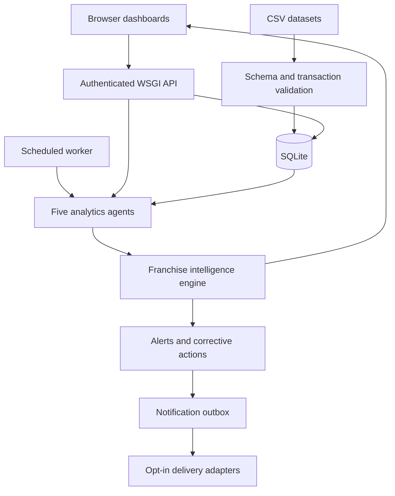
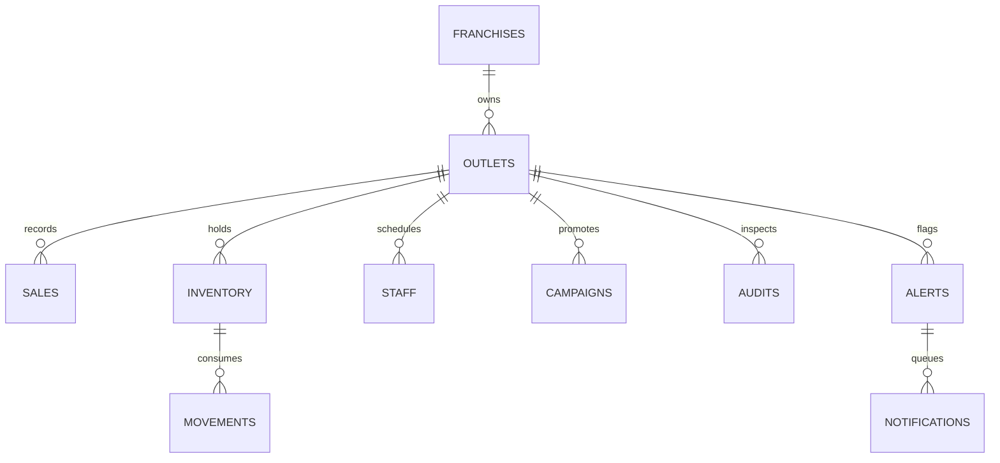

# Architecture and requirements mapping

## Request and agent flow

Five agent functions return structured metrics and findings. The engine combines module scores and applies a critical-audit override. Optional LLM narration sits after analysis and has no mutation tools. The action workflow controls ownership, due dates, evidence and escalation. CSV mutations are transactional; all connections enable foreign keys and WAL.

## Storage

`runs` stores orchestration summaries. `activity` stores import, action and execution events. See `schema.sql` for exact field definitions and constraints.

## Data time semantics

Sales have daily grain. Dashboard sales comparisons use the selected inclusive interval and its immediately preceding equal-length interval. Peer averages use recorded daily observations; coverage exposes missing dates. Inventory uses the current on-hand snapshot plus up to 28 usage observations in the last 28 calendar days. Audit uses the newest inspection per outlet/category. Staff and campaigns represent the period supplied by the operator and are not backdated by sales filters.

## Health score contracts

Performance = clamp(0.4 × min(peer index,100) + 0.3 × min(margin/30×100,100) + 0.3 × min(70+growth,100)). Missing growth uses zero growth; a missing peer baseline uses a neutral index of 100. No sales records yield no performance score.

Inventory = 100 × (1 − shortage item fraction). Staff = mean capped attendance. Marketing = clamp(mean(70 + 0.3 × contribution ROI)). Audit = mean latest inspection scores. Franchise score uses weights 30/20/15/15/20%; unavailable modules are excluded and weights renormalized. Available module count is displayed. Risk High if score <60 or any critical audit; Medium below 80; Low otherwise. No available modules means No data.

## Deployment boundary

Single-process WSGI with threaded serving; SQLite serializes writes. Tokens and login throttling are process local. Use exactly one web worker until sessions and rate limits move to shared storage. Multiple franchises are data-supported, but access is organization-wide rather than tenant-scoped. No cross-tenant authorization claim is made.
