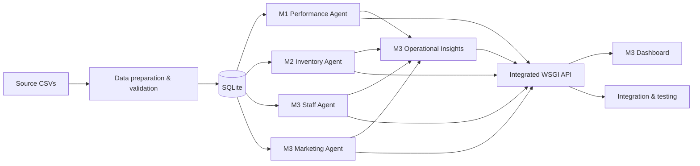
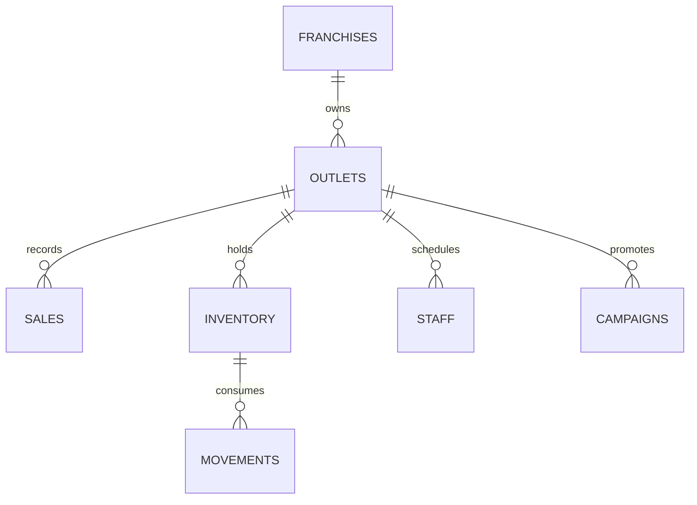

# Architecture — Milestones 1–3

## End-to-end Milestone 3 flow

The Milestone 3 dashboard depends on earlier milestone outputs but the project does not add a separate composite franchise-intelligence layer.

## Storage

`runs` stores integration run summaries. `activity` records data imports and analytics runs.

## Metric contracts

**Performance (M1):** revenue, cost contribution, margin, equal-period growth, peer daily-revenue index and an explainable performance score.

**Inventory (M2):** trailing 28-day average demand, lead-time safety stock, reorder point, 7-day forecast, days cover, replenishment quantity, waste and expiry.

**Workforce (M3):** worked/scheduled coverage percentage, uncovered hours, orders per worked hour and a simple coverage status.

**Marketing (M3):** CTR, click-to-conversion rate, ROAS, margin-adjusted contribution ROI, contribution value and cost per conversion.

**Operational Insights (M3):** deterministic rules convert weak signals from the four modules into source-labelled evidence and recommendations. No new global score is calculated.
